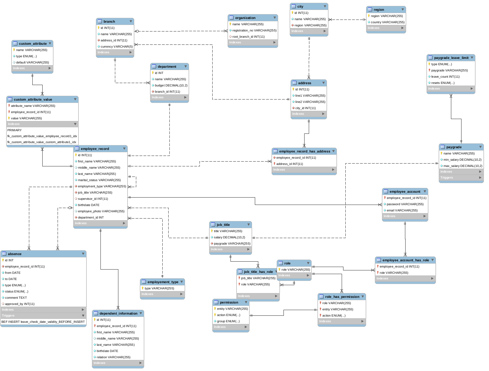

# Human Resource Managment System Project

Human Resource Managment System made for CS 3042 group project

## Functional Requirements

- [ ] HR admin should be able to add employee data to the system
- [ ] Managerial employees should be able to edit personal information
- [ ] Employees should be able to view personal information/leave counts
- [ ] Admin(or any suitable role as defined in your SRS) should be able to define new custom employee attributes
- [ ] Employees should be able to apply leave through system
- [ ] Supervisors should be able to view leave requests and approve them
- [ ] System should update leave counts of each employee when leaves are approved
- [ ] Managerial employees should be able to view leave counts of the employees
- [ ] Admin(or any suitable role as defined in your SRS) should be able to configure leave related properties, add/remove job titles, pay graded etc.
- [ ] System should be able to generate the following reports
  - [ ] Employee by department
  - [ ] Total leaves in given period by department
  - [ ] Employee reports grouped by job title, department, pay grade etc.
  - [ ] Reports based on custom fields (should contain at least 2 custom fields created beforehand)

## ERD

## Technologies

* [Express](https://expressjs.com/) - The web framework used
* [NPM](https://www.npmjs.com/get-npm/) - Package Management
* [MySql](https://www.mysql.com/) - Database System

## Authors
